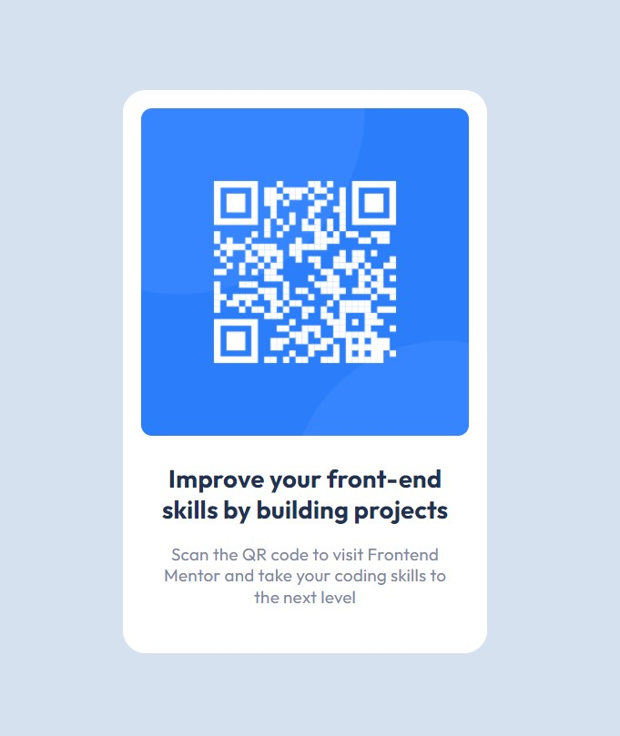

# Frontend Mentor - QR code component solution

This is a solution to the [QR code component challenge on Frontend Mentor](https://www.frontendmentor.io/challenges/qr-code-component-iux_sIO_H).

## Table of contents

- [Overview](#overview)
  - [Screenshot](#screenshot)
- [My process](#my-process)
  - [Built with](#built-with)
  - [What I learned](#what-i-learned)
  - [Useful resources](#useful-resources)
- [Author](#author)

**Note: Delete this note and update the table of contents based on what sections you keep.**

## Overview

### Screenshot

## My process

### Built with

- Semantic HTML5 markup
- CSS custom properties
- Flexbox

### What I learned

For this Newbie project, I've tried to follow the BEM guidelines as well as i could.
This is my first ever component, so I'm pretty proud of it :)

I'm planning to make it a bit more clean and adaptive in the nearest future. 

### Useful resources

I've used the PerfectPixel Chrome extension to keep track of the paddings and font sizes
Some useful BEM links:

https://ru.bem.info/methodology/css/
https://nicothin.pro/idiomatic-pre-CSS/#bem

## Author

- Frontend Mentor - [@a-falkonia](https://www.frontendmentor.io/profile/a-falkonia)

